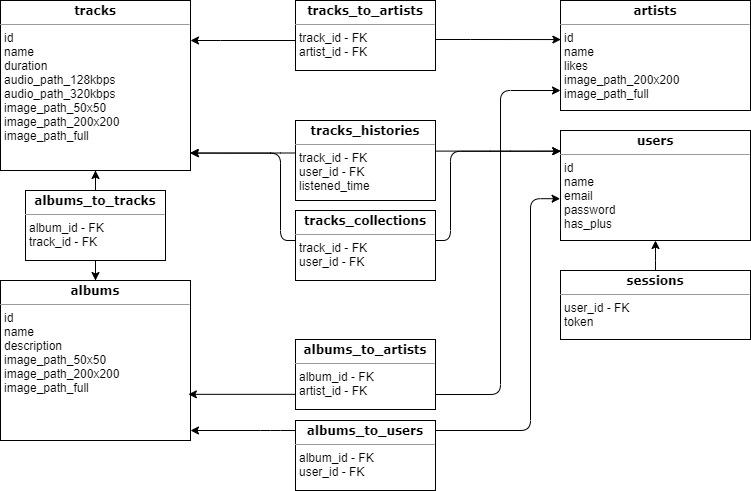
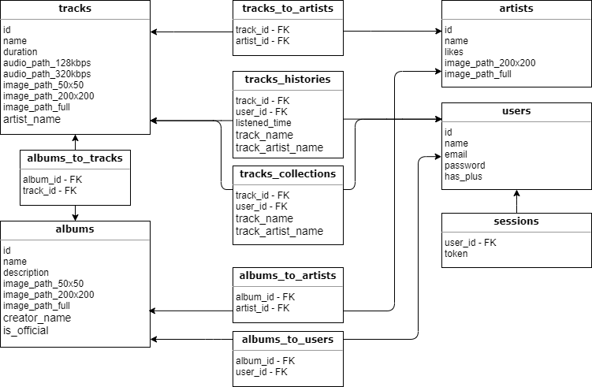
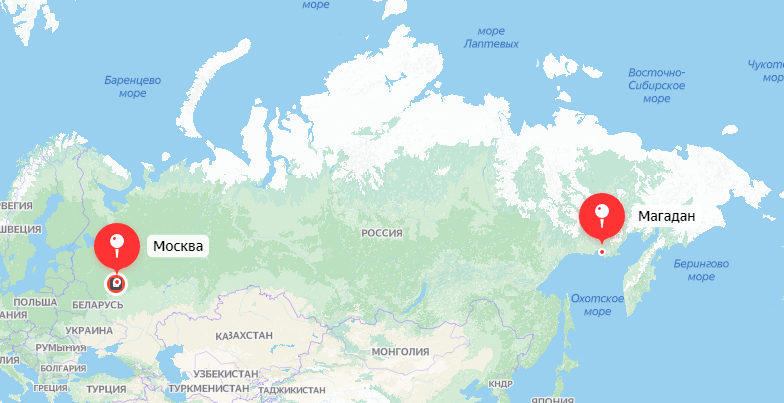
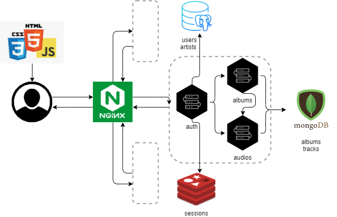

# Архитектура высоконагруженного веб-сервиса
----------------
## Yandex.music
Яндекс.Музыка - популярный в России сервис по прослушиванию музыки

## MVP
* Получение трека - аудиофайла
* Получение списка рекомендаций
* Загрузка музыки исполнителями

## [Аудитория](https://radar.yandex.ru/yandex?month=2021-08)
* Месячная: 10 701 402
* Дневная: 2 043 505
* Среднее время за месяц: 2 ч 34 м
* Среднее время за день: 2 ч 34 м / 30 д = 5,13 м
* Процент мобильных пользователей: 48 %
* Кол-во зарегистрированных пользователей: [>3 млн. на 2019](https://vc.ru/media/96460-chislo-podpischikov-yandeks-muzyki-vyroslo-v-tri-raza-za-poltora-goda-i-dostiglo-3-millionov). Сервису 10 лет. Сейчас ~4млн.
* Пользователи из России
* На старте было доступно [800 тыс. треков от 58 тыс. исполнителей](https://ru.wikipedia.org/wiki/Яндекс.Музыка). Сейчас треков [>60 млн](https://re-store.ru/blog/sravneniya/music-services-in-russia/). Значит исполнителей ~2 млн.

> Яндекс.Музыка - приложение для российского рынка, как и остальные проекты яндекса.
> Целевая аудитория - преимущественно, люди до 45 лет, ведь именно они - основные потребители музыки в целом.

### [Возрастное распределение аудитории](https://webindex.mediascope.net/report/sex-and-age?byDevice=3&byDevice=1&byDevice=2&byGeo=1&byMonth=202106&id=447221)
12 - 24  | 25 - 34  | 35 - 44  | 45 - 54  |   55 +   |
---------| ---------| ---------| ---------| ---------|
14,25 %  | 28,40 %  | 28,00 %  | 14,43 %  | 14,24 %  |

----------------
# Расчёт нагрузки (сеть)
* Час музыки весит: [115 МБ](https://yandex.ru/support/music-app-android/offline/save-music.html)
    * минута музыки: 115 / 60 = 1,92 МБ
* Средняя длительность трека: 3 мин.

### Трафик на раздачу:
Будем исходить из того, что пиковая нагрузка в 2,5 раза больше средней. Обуславливается тем, что вечером большинство людей возвращается с работы/учёбы и нагрузка на сеть повышается.
* За день: 5,13 мин. * 2 043 505 польз. = 10 483 180,65 мин/д = 20 127 706,85 МБ/д = 153,56 Тб/д.
* За секунду: 153,56 Тб/д = 1 908 404 б/сек = 1,82 Гб/сек.

Сессия состоит из:
* Получение главной страницы - списка плейлистов, подкастов, чартов. Таких списков на ней 6. В каждом в среднем по 4 элемента. Для каждого элемента нужно ещё получить картинку размером ~20 кБ. 6 * 4 * 20 = 480кБ. 6 запросов.
    * Для браузерных пользователей - вся SPA-страница. ~2Мб. ~30 запросов на сервер со статикой.
    * Браузерных пользователей половина, так что в среднем (2000 + 480) / 2 = 1240кБ. Но те же 6 запросов на API-сервер.
* Нажатие на кнопку "Моя волна" (рекомендации) - получение списка аудио. Картинка + информация о каждой весит ~2,1кБ: 20шт * 2,1кБ = 42кБ.
    * Или переход в "Мои аудио" - получение аналогичного списка. Тогда 1 из 3 пользователей пролистывает список на 100 аудио вниз, это ещё 5 таких запросов. 42кБ * 5 / 3 = 67,3кБ.
    * Или переход в "Радиостанции" - получение аналогичного списка.
    * Всего (42 + 42 + 67,3) / 3 = 50,4кБ. (1 + 1 + 6) / 3 = 2,6 запроса.
* Пусть 1 из 3 пользователей ищет песню. Там живой поиск, так что, чтобы найти нужный трек, необходимо ~7 символов (исполнитель), и ~20 символов (с названием трека). Каждый запрос - 17 лучших совпадений, ~25 символов в каждом. (7 + 20) / 2 / 3 = 4,5 запросов. 4,5 * 17 * 25Б / 3 = 637,5Б.
* Регистрацию пользователей учитывать не будем. Она происходит достаточно редко.
* Прослушивание аудиозаписи - получение всех её данных, включая обложку. ~20кб + вес аудио. Притом за 5 минут среднего онлайна в день прослушивает пользователь 5/3 = 1,6 трека. 1,6 * 2 = 3,2 запроса. 1,6 * 20 = 26,6кБ.


__________________        | Запросов   | кБ      |
--------------------------| -----------| --------|
Главная страница          | 6          | 1240    |
Рекомендации/мои аудио    | 2,4        | 50,4    |
Поиск                     | 4,5        | 0,6     |
Регистрация               | -          | -       |
Прослушивание             | 3,2        | 26,6    |
Всего                     | 16,1       | 1317,6  |

```
Запросов за день (RPD): 16,1 * 2 043 505 польз. = 32 900 430,5 запросов/д.
Запросов в секунду (RPS): 32 900 430,5 / 86 400 = 380 запросов / сек.
Пиковый RPS: 380 * 2,5 = 952 запросов / сек.
```
```
Трафик в день: 1317,6 / 2 043 505 польз. = 2 692 522 188 кБ/д. = 2,5 Тб/д.
Трафик в секунду: 2 692 522 188 / 86 400 = 31 163,5 кБ/сек. = 243,5 Мб/сек.
Пиковый трафик: 30,5 * 2,5 = 608,6 Мб / сек.
```

### Трафик на загрузку:
За минуту загружается ~20 мин музыки. Это обусловлено тем, что на Яндекс.Музыку не может загрузить трек любой желающий, а лишь подтверждённые музыканты.
```
Запросов в день (RPD): (20 / 3) треков/мин * 60 * 24 = 9 600 запросов/день
Запросов в секунду (RPS): 9 600 / 86 400 = 0,1
Пиковый RPS: 0,1 * 2,5 = 0,25
```
```
Трафик в секунду: 20 * 1,92 = 38,4 МБ/мин. = 5 242,88 б/сек. = 5,12 Мб/сек.
Пиковый трафик: 5,12 * 2,5 = 12,8 Мб / сек.
Трафик в день: 5 242,88 * 86 400 = 452 984 832 б/день = 55 296 кБ/день
```


### Сводная таблица (RPS, Трафик)
   ______  | RPD | RPS | Пиковый RPS | Трафик в день (кБ/день) | Трафик в сек (мб/сек) | Пиковый трафик (мб/сек) |
---------- | ----| ----| ------------| ------------------------| ---------------------| -----------------------|
Раздача    | 28 609 070 | 332  | 828  | 2 692 522 188 | 243,5 | 608,6 |
Загрузка   | 9 600      | 0,1  | 0,25 | 55 296        | 5,12  | 12,8  |
Всего      | 28 618 670 | 333  | 829  | -             | -     | -     |

----------
# Расчет нагрузки (хранение)
### Логическая схема БД


### Денормализованная схема БД
В таблицу tracks добавлено поле artist_name, в albums - creator_name и is_official, в tracks_histories и tracks_collections - track_name и track_artist_name. 


###Теперь определимся с количеством строк каждой таблицы
* Пользователей: 4 млн. - `users`
* Треков >60млн. Пусть: 62 млн. - `tracks`
* Исполнителей: 2 млн. - `artists`
* Сессий пусть 0,1% от пользователей: 4 тыс. - `sessions`
* Альбомов пусть будет по 4 на исполнителя и по 2 на пользователя: 2 млн * 4 + 4 млн * 2 = 16 млн. - `albums`
* 2 млн * 4 = 8 млн. - `albums_to_artists`
* 4 млн * 2 = 8 млн. - `albums_to_users`
* Пусть у 1-ой из 7 песен 2 исполнителя, а не 1. Тогда: 62 млн / 7 * 8 = 70,8 млн. - `tracks_to_artists`
* Пусть в альбоме исполнителя в среднем [12 треков](https://ru.wikipedia.org/wiki/Музыкальный_альбом), а в альбоме пользователя в среднем 30 треков. Тогда: 8 млн * 12 + 8 млн * 30 = 336 млн. - `albums_to_tracks`
* Пусть добавленных аудио у пользователя в среднем 200. Тогда 4 млн * 200 = 800 млн. - `tracks_collections`
* История прослушиваний хранится 3 дня. Каждый пользователь слушает за 5 минут в день 1,66 трека. За 3 дня на всех будет: 4 млн * 1,66 * 3 = 19,9млн  - `tracks_histories`

### Общий размер данных в БД
```
int - 4Б
text - 20 символов в utf-8: 20 * 4Б = 80Б 
bool - 1Б
```

Таблица           | Строк (млн) | Данных на строку (Б)         | Всего данных (МБ) |
------------------| ------------| -----------------------------| ------------------|
users             | 4           | 1 * 4 + 3 * 80 + 1 * 4 = 248 | 946
tracks            | 62          | 2 * 4 + 7 * 80 = 568         | 33 584,5
artists           | 2           | 2 * 4 + 3 * 80 = 248         | 473
sessions          | 4           | 1 * 4 + 1 * 80 = 84          | 320,5
albums            | 16          | 1 * 4 + 6 * 80 + 1 * 4 = 488 | 7 446
albums_to_artists | 8           | 2 * 4 = 8                    | 61
albums_to_users   | 8           | 2 * 4 = 8                    | 61
tracks_to_artists | 70,8        | 2 * 4 = 8                    | 540
albums_to_tracks  | 336         | 2 * 4 = 8                    | 2 563,5
tracks_collection | 800         | 2 * 4 + 2 * 80 = 168         | 128 174
tracks_histories  | 19,9        | 2 * 4 + 2 * 80 = 168         | 3 076

Всего: 946 + 33584,5 + 473 + 320,5 + 7446 + 61 + 61 + 540 + 2563,5 + 128174 + 3076 = 177 245,5 МБ.
> *173 ГБ пользовательских данных*
----
###Аудио (3 минуты):
  * 128kbps = 3 мин * (85 МБ / 60 мин) = 4,25 МБ
  * 320kbps = 3 мин * (145 МБ / 60 мин) = 7,25 МБ
> *62 млн * (4,25 + 7,25) = 680 ТБ аудио*
----
###Изображения для треков, альбомов, исполнителей:
  * 200х200px = 30кБ
  * 50х50px = 2кБ
  * Fullsize(1000х1000px) = 100кБ
> *(62 млн + 16 млн) * (30 + 2 + 100) + 2 млн * (30 + 100) = 9,8 ТБ изображений*

----
## Выбор технологий
Фронтенд будем писать, как SPA, на [самом популярном фреймфорке **React**](https://trends.google.com/trends/explore?cat=5&date=today%205-y&q=React,Angular,Vue,Backbone,Ember).
Популярность обусловлена высокой производительностью из-за использования Virtual DOM.
А ещё нам нужно мобильное приложение, потому что в браузере музыку слушают только десктопные пользователи.
Его напишем на `Kotlin`, потому что это относительно прогрессивный и новый язык со старым синтаксисом от Java.

Чтобы раздавать фронтенд пользователям, нам бы понадобился CDN, но приложение работает только в России,
так что по два дата-центра в Москве и Магадане будет достаточно:


Также необходим DNS для домена. Пишем мы Яндекс.Музыку, потому выбора у нас просто нет, кроме как `Яндекс.DNS`)

Затем необходимо обрабатывать через L7 балансер запросы на API.
В качестве балансера возьмём `Nginx`.

Сам API-сервер будем писать на `Go`. Разработка на этом языке намного быстрее и проще, чем на C++,
а небольшие жертвы производительности это оправдывают.

При разработке будем использовать микросервисную архитектуру с общением микросервисов по `GRPC`. Она удобна тем, что разработка осуществляется независимыми модулями и в случае необходимости добавления нового функционала приложения, это можно сделать, практически не меняя остальных частей.

Микросервисы должны обращаться к базам данных. Таблицы, которые достаточно часто подвергаются записи новых данных -
tracks_collections, tracks_histories.
От остальных таблиц необходимо лишь быстрое чтение.
Исходя из этого, можно сделать вывод, что таблицы `users и artists` можно хранить в SQL базе данных MySQL или `PostgreSQL`.
Я бы выбрал вторую, потому что она постоянно поддерживается и развивается, между тем как в MySQL нового функционала не появляется.

Для `sessions` подойдёт noSQL key-value база данных. Например, `Redis` или Azure Cosmos DB. Выбираем первую из-за его открытого кода и необязательности лицензии.

Для всех остальных таблиц можно взять любую noSQL базу данных из-за их быстроты доступа на чтение, а так же удобной реализации many-to-many связей между таблицами,
которых у нас большинство. Можно взять `MongoDB` или Tarantool. Значительных различий я не вижу, и выберу первую из-за её популярности,
а значит, и большого количества разработчиков, умеющих с ней работать.

## Физическая схема


Необходимо рассчитать характеристики и кол-во реальных серверов.

### Балансер
Nginx может обрабатывать [9 871 RPS](https://www.nginx.com/blog/testing-the-performance-of-nginx-and-nginx-plus-web-servers/) для 100КБ-ных HTTPS запросов на 2-х ядрах.
Этого нам вполне хватит.

________        | Кол-во |
 ---------------| -------|
CPU (ядра)      | 2
Network (Mbps)  | 600
RAM (Gb)        | 16
SSD (Gb)        | 64

### Микросервисы
Требуется производительность и RAM. Много физической памяти не требуется 

________        | Кол-во |
 ---------------| -------|
CPU (ядра)      | 4
RAM (Gb)        | 16
SSD (Gb)        | 4

### Redis
Хранит пользовательские данные и сессии. Их размер 0,4 ГБ. Много памяти не требуется 

________        | Кол-во |
 ---------------| -------|
CPU (ядра)      | 4
RAM (Gb)        | 16
SSD (Gb)        | 16

### PostgreSQL
Среднее кол-во RAM и CPU. Размер данных - 1,4 ГБ.

________        | Кол-во |
 ---------------| -------|
CPU (ядра)      | 4
RAM (Gb)        | 16
SSD (Gb)        | 16

### MongoDB
Самая загруженная часть. Большое кол-во RAM и CPU для обработки большого числа запросов. Размер данных - 170 Гб.

________        | Кол-во |
 ---------------| -------|
CPU (ядра)      | 16
RAM (Gb)        | 32
SSD (Gb)        | 256+

Необходимо обеспечивать отказоустойчивость в случае выхода диска их строя. Так что будет RAID 5 массив из 3-х дисков по 256 ГБ.  


### Хранилище аудио и картинок
Большое кол-во RAM и CPU для обработки большого числа запросов. Размер данных - 680 + 9,8 = 690 ТБ.

________        | Кол-во |
 ---------------| -------|
CPU (ядра)      | 16
RAM (Gb)        | 32
SSD (Tb)        | 700

Конечно, ни в один диск 700 Tb не влезет. Если забить стандартную стойку на 26 мест SSD дисками по 3,84 Tb, в ней будет 99,84 Tb.
Значит нам понадобится 8 таких стоек.
В каждой диски будут объединены в RAID 0 массив, ведь с них необходимо быстрое чтение.
Если один из дисков выйдет из строя, у нас есть копии данных в других дата-центрах, так что восстановить его,
просто скопировав данные с имеющегося диска, будет не на много дольше, чем восстанавливать их из RAID массива, вроде RAID 5.
